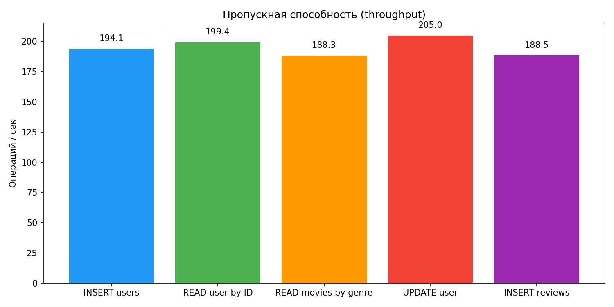
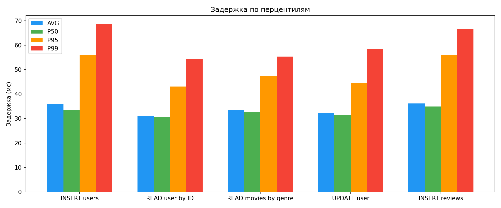
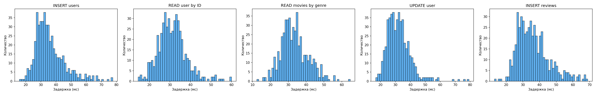

# Итоговое задание по модулю 3 - Нереляционные базы данных

**Студент:** Кислощаев Михаил Константинович
**Дисциплина:** Нереляционные базы данных
**Задание:** Проектирование БД с горизонтальным масштабированием (шардингом)

---

## 1. Схема базы данных

### Предметная область: Онлайн-кинотеатр

В качестве предметной области выбран онлайн-кинотеатр. БД `online_cinema` состоит из трёх коллекций:

#### Коллекция `movies` (фильмы)
| Поле | Тип | Описание |
|------|-----|----------|
| `movie_id` | int | Уникальный идентификатор фильма |
| `title` | string | Название |
| `genre` | string | Жанр |
| `year` | int | Год выпуска |
| `director` | string | Режиссёр |
| `duration_min` | int | Длительность в минутах |
| `rating` | float | Средний рейтинг |

#### Коллекция `users` (пользователи)
| Поле | Тип | Описание |
|------|-----|----------|
| `user_id` | int | Уникальный идентификатор пользователя |
| `username` | string | Имя пользователя |
| `email` | string | Email |
| `subscription` | string | Тип подписки (free/standard/premium) |
| `registered_at` | string | Дата регистрации |

#### Коллекция `reviews` (отзывы)
| Поле | Тип | Описание |
|------|-----|----------|
| `user_id` | int | ID пользователя |
| `movie_id` | int | ID фильма |
| `rating` | int | Оценка (1-10) |
| `text` | string | Текст отзыва |
| `created_at` | string | Дата создания |

---

## 2. Реализация шардинга

### Архитектура кластера

Кластер поднимается через Docker Compose и включает в себя следующие компоненты:

```
┌─────────────┐
│   mongos     │  - роутер (порт 27020)
│  (router)    │
└──────┬───────┘
       │
┌──────┴───────┐
│  configsvr1  │  - config server (replica set configRS)
└──────────────┘
       │
┌──────┴──────────────────┐
│                         │
▼                         ▼
┌──────────────┐  ┌──────────────┐
│  shard1svr1  │  │  shard2svr1  │
│ (shard1RS)   │  │ (shard2RS)   │
└──────────────┘  └──────────────┘
```

- **Config Server** (`configRS`) - хранит метаданные кластера и информацию о распределении чанков
- **2 шарда** (`shard1RS`, `shard2RS`) - каждый представляет собой replica set из одного узла
- **mongos** - роутер запросов, через него подключается клиент (порт 27020)

### Стратегия шардинга

Для всех трёх коллекций выбран hashed-шардинг:

| Коллекция | Shard Key | Обоснование |
|-----------|-----------|-------------|
| `movies` | `movie_id` (hashed) | Хеш-шардинг даёт равномерное распределение фильмов по шардам, даже при последовательных ID |
| `users` | `user_id` (hashed) | Позволяет избежать «горячих» шардов при активной регистрации новых пользователей |
| `reviews` | `user_id` (hashed) | Отзывы одного пользователя хранятся на одном шарде, поэтому запрос «все отзывы пользователя» идёт точечно (targeted query), а не по всем шардам |

### Запуск кластера

```bash
# 1. Поднять контейнеры
docker-compose up -d

# 2. Инициализировать кластер
bash scripts/init_cluster.sh

# 3. Установить зависимости
pip install -r requirements.txt

# 4. Заполнить БД тестовыми данными (пункт 4 в меню)
python -m app.cli
```

---

## 3. Python-интерфейс

Консольный интерфейс реализован в `app/cli.py`. Через него можно работать со всеми тремя коллекциями:

- **Фильмы** - добавление, поиск по ID, список с фильтром по жанру, обновление полей, удаление
- **Пользователи** - добавление, поиск по ID, список с фильтром по подписке, обновление, удаление
- **Отзывы** - добавление, просмотр по пользователю или фильму, обновление оценки, удаление

Также есть возможность заполнить БД тестовыми данными (1000 пользователей, 50 фильмов, ~4000 отзывов) и посмотреть статистику распределения данных по шардам.

```bash
python -m app.cli
```

---

## 4. Нагрузочное тестирование

### Методология

Для нагрузочного тестирования написан скрипт `load_test.py`, который при помощи `ThreadPoolExecutor` параллельно выполняет операции с БД и замеряет время каждой из них.

Параметры:
- 500 операций на каждый тест
- 10 параллельных потоков
- MongoDB 7.0, шардированный кластер из 2 шардов

Тестировались следующие операции:

| Тест | Описание |
|------|----------|
| INSERT users | Вставка нового пользователя |
| READ user by ID | Поиск пользователя по `user_id` (targeted query) |
| READ movies by genre | Поиск фильмов по жанру (scatter-gather query) |
| UPDATE user | Обновление подписки пользователя |
| INSERT reviews | Вставка нового отзыва |

### Метрики

Для каждого теста собираются:
- **Throughput** (операций/сек)
- **Средняя задержка**, а также перцентили **P50, P95, P99**
- **Максимальная задержка**
- **Количество ошибок**

### Результаты

После запуска результаты сохраняются в папку `results/`:
- `results.json` - сырые числа
- `throughput.png` - график пропускной способности
- `latency_percentiles.png` - сравнение задержек по перцентилям
- `latency_distribution.png` - гистограммы распределения задержек

```bash
python load_test.py
```

### Графики

#### Пропускная способность


#### Задержка по перцентилям


#### Распределение задержек

